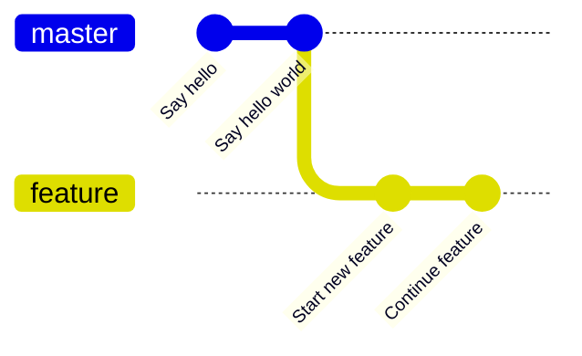
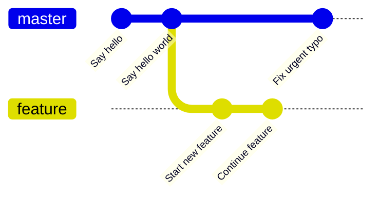
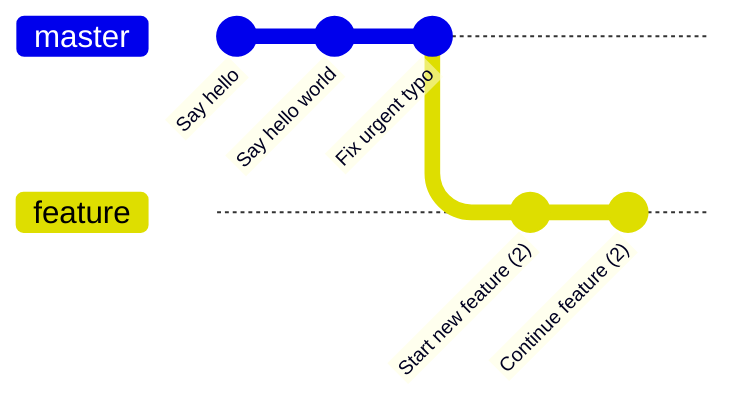
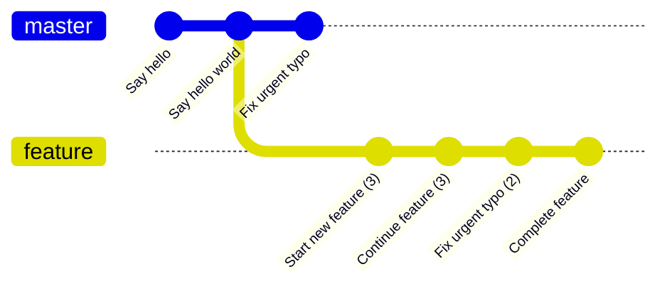
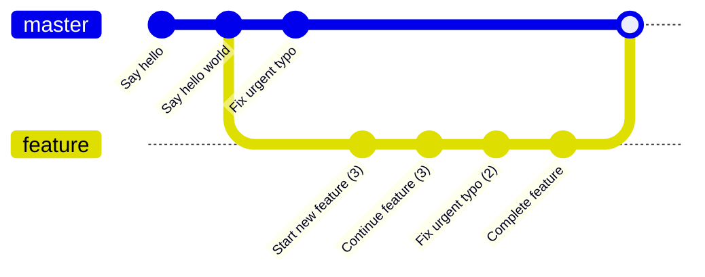

This was inspired by a question about why duplicate commits sometimes appear in the commit log. [This Stackoverflow post](https://stackoverflow.com/questions/9264314/git-commits-are-duplicated-in-the-same-branch-after-doing-a-rebase/30927009#answer-30927009) has some useful explanation of a similar situation.

### Working on feature branch



## Fix made on master



## Incorporate fix into feature



## Pushing feature branch

Git won’t let us push as the feature commits have been recreated so the history has diverged.

```shell
 ! [rejected]        feature -> feature (non-fast-forward)
error: failed to push some refs to '../exercise-remote.git'
hint: Updates were rejected because the tip of your current branch is behind
hint: its remote counterpart. Integrate the remote changes (e.g.
hint: 'git pull ...') before pushing again.
hint: See the 'Note about fast-forwards' in 'git push --help' for details.
```

So we run `git pull`, and it does this.



## Merge feature into master

We want to release our feature, so we merge our branch in. Now the duplicate commit appears in the log for master.



```shell
$ git checkout master && git --no-pager log --oneline --no-decorate

8ed0e39 Merge feature into master
45f34bf Complete feature
faebc00 Fix urgent typo
ad7eaaa Fix urgent typo
7ac59d1 Continue feature
f28c8cb Say hello world
f567cf9 Start new feature
5d99ac2 Say hello
```